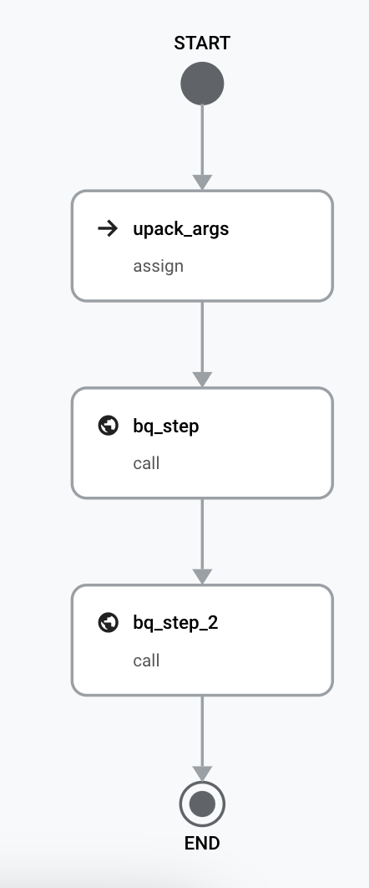

# Goblet Workflows (Beta)


[](https://codecov.io/gh/goblet/goblet_workflows)

Goblet Workflows is a wrapper around [GCP Workflows](https://cloud.google.com/workflows/docs/overview), which is a fully-managed orchestration platform that executes services in an order that you define: a workflow. These workflows can combine services including custom services hosted on Cloud Run or Cloud Functions, Google Cloud services such as Cloud Vision AI and BigQuery, and any HTTP-based API.

While GCP Workflows is powerful, it requires learning a complex yaml DSL, which makes it hard to manage and scale, and has a steap learning curve to get started. 

Goblet Workflows uses similar syntax that you can expect from airflow and prefect, to make it easy to write, deploy, and manager your workflows, while leveraging the severless nature of GCP workflows. 

See below for a simple workflow example. 

```python
from goblet_workflows.workflow import Workflow
from goblet_workflows.steps import AssignStep, BQStep

w = Workflow("bigquery-step-example", params=["column"])

upack_args = AssignStep(
    w,
    "upack_args",
    column="${column}"
)

bq_step = BQStep(w, "bq_step", "select {column} from DATASET limit 1")

bq_step_2 = BQStep(w, "bq_step_2", "select colomn2 from DATASET2 where column1 = {bq_step[0]} ")

upack_args > bq_step > bq_step_2
```

Not to deploy you simply have to run the command `goblet_workflows deploy`, which will yield the workflow below.

<br />
<p align="center">

</p>
<br />

## Getting started

To install run: 

`pip install goblet_workflows`

To deploy a workflow create a `main.py` file where you define your workflow and steps.

Then run 

`goblet_workflows deploy`

To view the yaml run 

`goblet_workflows print`

## Examples

[Goblet Workflow Examples](https://github.com/goblet/goble_workflows/blob/main/examples)

## Features

* Generic Steps
* Branches
* Deployment of Workflows and Schedules
* GCP Connectors

## GCP Workflows 

[Overview](https://cloud.google.com/workflows/docs/overview)

[Syntax Cheat Sheet](https://cloud.google.com/workflows/docs/reference/syntax/syntax-cheat-sheet)

## Issues

Please file any issues, bugs or feature requests as an issue on our [GitHub](https://github.com/goblet/goblet_workflows/issues) page.

## Roadmap

 &#9745; Http Steps \
 &#9745; GCP Generic Connectors \
 &#9745; BQ Connector \
 &#9745; Dataform Connector \
 &#9745; Deploy \
 &#9745; Deploy Arbitrary File\
 &#9744; Execute \
 &#9744; Delete \
 &#9745; Schedule \
 &#9744; Conditions \
 &#9744; Subworkflows \
 &#9744; Parameter typing


## Want to Contribute

If you would like to contribute to the library (e.g. by improving the documentation, solving a bug or adding a cool new feature) submit a [pull request](https://github.com/goblet/goblet_workflows/pulls).
